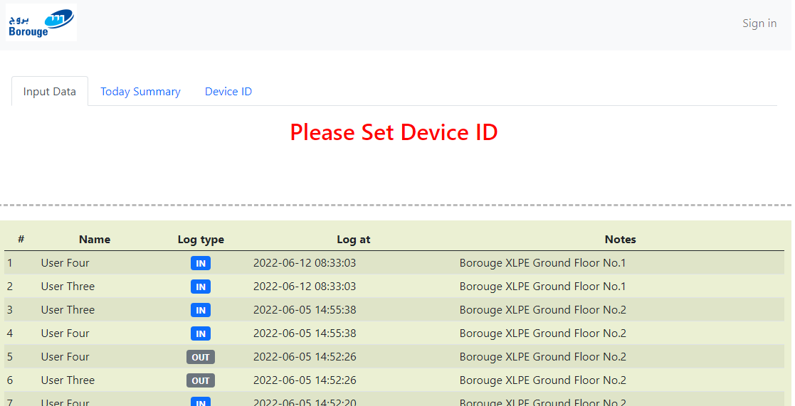
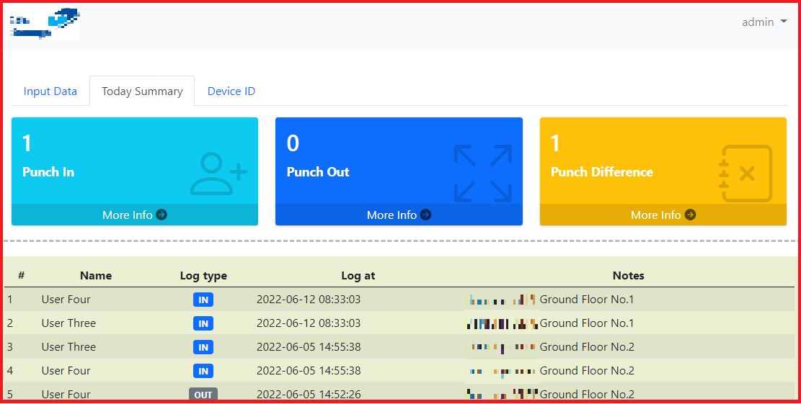
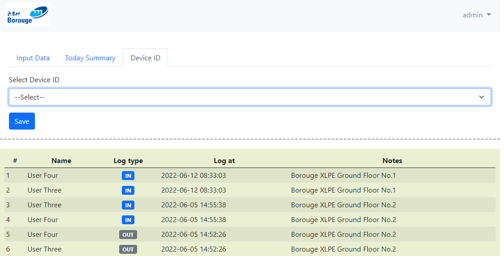
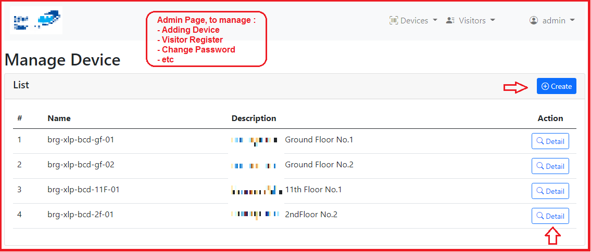
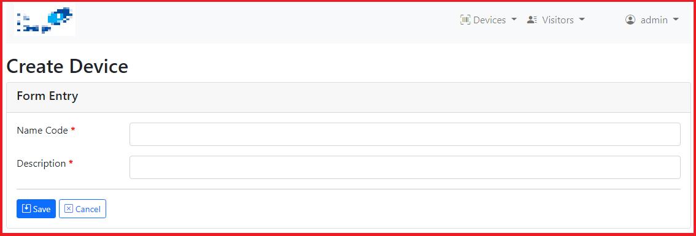

## Project : Visitor
**************************

An application to record visitors entrance and exit in a building. The data to be used for head counting in case of any incident happend.

### Features
**************************
- Multi level Login/Authorization
- Device management
- Visitor/User management
- Upload file
- Search data and pagination
- Table auto reload by Pure Javascript 

### More Info
**************************
- Started Mid-May 2022
- Using PHP Framework: Codeigniter 3.113.
- Using MariaDB-MySQL.
- Using Bootstrap 5.

### Snapshot
**************************
{:width="300px"}

