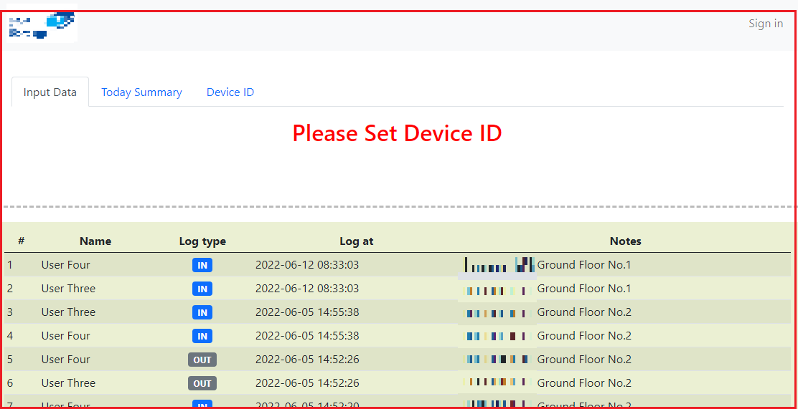
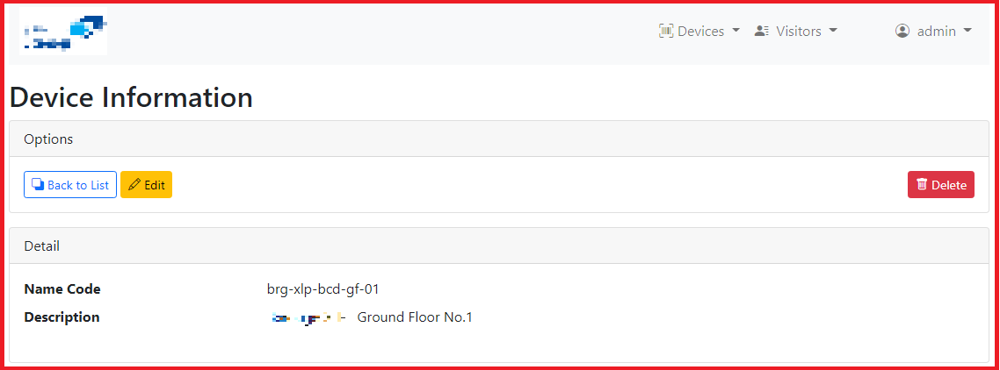

## Project : Visitor

An application to record visitors entrance and exit in a building. The data to be used for head counting in case of any incident happend.

### Features
**************************
- Multi User Login/Authorization.
- Device management.
- Visitor/User management.
- Upload file.
- Simple & Complex Search Data and Pagination.
- Table auto reload by Pure Javascript (without JQuery).
- Using Hash Password and Token system.
- Barcode generator Using Zend Barcode Library.
- Simple Print Report Facility to Print the Barcode for User ID recognation.

### More Info
**************************
- Started Mid-May 2022.
- Using PHP Framework: Codeigniter 3.1.13.
- Using MariaDB-MySQL.
- Using Bootstrap 5.
- Using Zend Barcode Library.

### Snapshot
**************************

